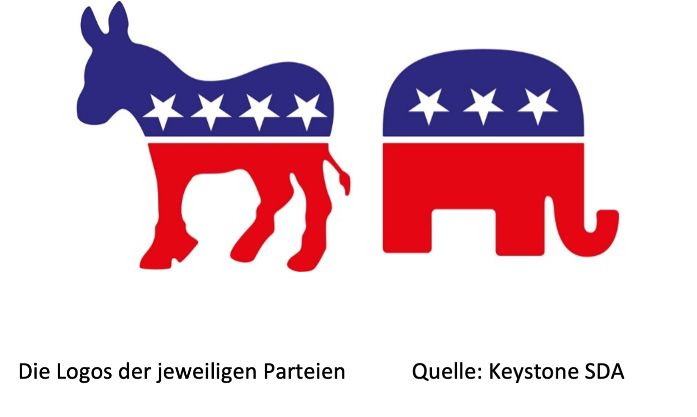

+++
title = "Zerstört sich die amerikanische Demokratie selbst?"
date = "1981-11-21"
draft = false
pinned = true
tags = ["Politik", "USA", "Amerika", "Deutsch", "Reportage", "Antifa", "KeinPlatzFürNazis"]
image = "sus.png"
description = "Die amerikanische Demokratie gilt als die älteste noch existierende Demokratie der Welt. Heute steht sie vor neuen Herausforderungen. In dieser Reportage soll untersucht werden, was diese Herausforderungen sind und wie bedrohlich die gegenwärtige Lage für die Demokratie in den Vereinigten Staaten wirklich ist."
footnotes = "\\*Name auf Wunsch geändert, Name den Autoren bekannt"
+++
**Die amerikanische Demokratie gilt als die älteste noch existierende Demokratie der Welt. Ihre Ursprünge reichen zurück bis zur Gründung im Jahr 1776 mit der Verabschiedung der Unabhängigkeitserklärung. Schon damals setzte sie sich für die Achtung der Menschenrechte ein. Doch heute steht sie vor neuen Herausforderungen. In dieser Reportage soll untersucht werden, was diese Herausforderungen sind und wie bedrohlich die gegenwärtige Lage für die Demokratie in den Vereinigten Staaten wirklich ist.**

von Leon und Simon

Rachel Anderson* lebt nun schon seit über 20 Jahren in Basel und kommt ursprünglich aus den USA. Sie hört jeden Tag amerikanische Nachrichten. Die Headlines über die Zerstörung amerikanischen Demokratie, die man in der letzten Zeit immer wieder lesen konnte, schockieren sie sehr, einerseits weil es um ihr Heimatsland geht und andererseits weil noch ein Teil ihrer Familie in den USA lebt. Wir konnten Sie an einem Dienstagnachmittag interviewen. 

 Am Anfang des Interviews sprachen wir mit Rachel Anderson vor allem über das politische System der USA. Rachel Anderson sagte, dass sie das politische System der Schweiz besser fände. Auch auf die Frage, was den Vorteile des amerikanischen Politsystems wären, zeichnete die Antwort ein ähnliches Bild.

> «Was im amerikanischen Politsystem ein Vorteil ist, ist auch im Schweizerischen System einer.»

# Der Elefant und der Esel

Durch diese anfängliche Diskussion wurden auch die Probleme der amerikanischen Demokratie schnell angesprochen. Eines der grössten, wenn nicht sogar das grösste Problem in der amerikanischen Politik, ist das Zweiparteiensystem.

In den USA gibt es zwei grosse Parteien, die Demokraten und die Republikaner. Die Demokratische Partei ist heute eine liberale Partei, welche sich für soziale Themen einsetzt, ihr Logo ist ein Esel. Manche Mitglieder haben sogar eine sozial-grüne Ausrichtung. Im Laufe der Zeit rutschte die Ausrichtung der Partei nach links. Die Demokraten sind für eine gute Sozialpolitik und für den Umweltschutz, bei Fragen nach Staatssicherheit gehen jedoch auch die Meinungen innerhalb der Partei auseinander. Wenn man aber historisch an das Thema herangeht, muss man feststellen, dass die Parteien einmal auf der politischen Gegenseite gestanden haben. Die Demokratische Partei setzte sich nämlich in Zeiten des Sezessionskrieges für die Fortführung der Sklaverei ein, während die Republikanische Partei damals für die Abschaffung war. Heute würde das Ganze andersherum aussehen, denn die Republikanische Partei, deren Logo der Elefant ist, setzt sich heute sehr für konservative Werte ein. Die Republikaner sind im rechten bis rechtsextremen politisches Spektrum zu verordnen, wobei sich die Partei in den letzten Jahrzehnten sehr stark nach rechts bewegt hat. Die Ziele der Republikaner könnte man mit der hier ansässigen Schweizer Volkspartei vergleichen, sie setzt sich z.B. für eine verschärfte Asylpolitik ein. Neben diesen beiden grossen Parteien existieren auch noch so genannte «Third Parties». Wie zum Beispiel die «Green Party of the United States» (Grüne Partei der Vereinigten Staaten), Die «Constitution Party» (Verfassungspartei) oder die «Libertarian Party» (liberale Partei). Diese Parteien haben in der USA wegen des politischen Systems aber in der Regel keine Chance auf grossen politischen Erfolg, da sie parteiintern zu wenig Geld haben. Diese Parteien erreichen bei den Präsidentschaftswahlen so etwa 0.2 Prozent bis 1.1 Prozent der Stimmen. Rachel Anderson sagt, dass diese höchstens auf lokaler Ebene eine kleine Chance hätten. Da kleinere Parteien, wie man hier gut sehen kann, keine Chance auf der weit bedeutsameren, nationalen Ebene haben, gibt es in den USA eben nur wenige grosse Parteien, momentan sind es eben nur zwei. Weil die kleinen Parteien auch gerne ihre Interessen auf nationaler Ebene adressieren möchten, sind sie dazu gezwungen, sich mit einer anderen, grösseren Partei zusammen zu tun, was häufig in einer Fusion der Parteien endet.

# Das Zweiparteiensystem

Eine der grössten Baustellen im amerikanischen Politsystem ist im Parteiensystem vorzufinden. In den USA gibt es nur zwei dominierende Parteien, die Demokraten respektive die Republikaner. Um zu verstehen, wieso es nur zwei mächtige Parteien gibt, muss man sich das Wahlsystem anschauen. In den USA herrscht das relative Mehrheitswahlrecht. Durch dieses kann immer nur eine Partei und deren Vertreter gewählt werden, die Stimmen, welche andere Parteien erhalten haben, verfallen. Eine weitere Verstärkung dieses Problems ist zudem, dass man bei der Präsidentenwahl nicht direkt den Kandidaten wählt. Was hiermit gemeint ist, ist die Wahl der Wahlmänner. In den USA wählt man bei der Präsidentenwahl Wahlmänner seines Bundesstaates, welche einen Kandidaten unterstützen. Die Zahl der Wahlmänner pro Bundesstaat hängt jeweils von der Grösse des Staates ab. Hier ist das Problem, dass alles nach dem «Winner takes all"-Prinzip abläuft. Das bedeutet, dass dem Präsidentschaftskandidaten, der in einem Bundesstaat die meisten Wahlmännerstimmen bekommt, auch noch gerade die Wahlmännerstimmen der Minderheit zu gesprochen werden. Schlussendlich gewinnt der Kandidat, der Bundesstaat übergreifend die meisten Wahlmännerstimmen für sich gewonnen hat. Dabei ist wichtig zu erwähnen, dass es zwei Ausnahmen gibt, die die Regel allerdings bestätigen: In den Staaten Maine und Nebraska werden die Wahlmänner proportional zu den Stimmen vergeben. In allen anderen Staaten bedeutet dies für die Bevölkerung, dass wenn sie in einem Staat wie Kalifornien Republikaner wählt, ihre Stimmen sowieso verloren sind, da Kalifornien schon immer demokratisch war und es bleiben wird. Stimmen für die sogenannten «Third Parties» verfallen, da sie keine Chance gegen die Übermacht der beiden Dominatoren haben.  Dazu diese Aussage hier, sie stammt von Rieke Havertz. Sie ist eine Expertin auf dem Themengebiet Politik der USA. 

> «Wenn ich als Amerikanische Wählerin mit meiner Stimme mir Gehör verschaffen will, muss sich für eine der grossen Parteien Stimmen entscheiden, den ansonsten versandet meine Stimme.»

Dies fördert alles ein System mit zwei Parteien. Denn nur eine Partei wird am Schluss etwas erreichen, während alle anderen am Schluss leer ausgehen werden. Also haben nur grosse Parteien eine Chance, da es nur einen Gewinner gibt. Darum lohnt es sich für kleinere Parteien sich einer grösseren Partei anschliessen. Etwas weiteres, was passieren kann ist, dass ein Kandidat durch die Wahlmännerstimmen gewählt wird, obwohl der andere mehr Einzelstimmen hatte. Dies passierte bei der Wahl 2016. Auf der Seite der Demokraten stand Hillary Clinton, während sich auf der Seite der Republikaner Donald Trump zur Wahl stellte. Wie wir alle wissen, wurde Trump gewählt, obwohl er insgesamt weniger Einzelstimmen hatte als Hillary Clinton.  

Eine Frage, die wir natürlich auch Rachel Anderson gestellt haben, ist, ob Trump, trotz anhaltender Kritik, ihrer Meinung nach gute Chancen auf eine Wiederwahl hätte.

> «Viele Republikaner sind so stark gegen die Demokratische Partei, dass sie Trump lieber als Präsident haben würden, auch wenn sie ihn nicht unterstützen, als einen Demokraten im Weissen Haus.»

Das ist auch der Grund wieso Skandale von Donald Trump, wie Fake News oder die bei ihm gefundene Geheimdokumente wohl keinen grösseren Einfluss auf die nächsten Wahlen haben. Die Wiederwahl von Joe Biden sieht sie auch als gut möglich, jedoch sieht sie ihn nur in der Rolle als ein beruhigendes Element, nach den vier extremeren Jahren unter Trump.

# Amerika, ein gespaltenes Land

Eine Auswirkung dieses System ist auch eine Radikalisierung der beiden Parteien in den USA. Das heisst, dass sie immer extremer werden, also dass sie sich immer weiter nach links respektive stark nach rechts bewegen. Dies hat nicht nur einen Einfluss auf die Politik, sondern auch auf die Gesellschaft. Über dieses Thema haben wir sehr lange mit Rieke Havertz gesprochen. Sie arbeitet bei «Zeit Online»  als USA -Korrespondentin. 

Wie wir alle wissen, kann man Politik und Gesellschaft nicht so einfach trennen, da in der Politik häufig auch Gesellschaftliche Themen behandelt werden. Wenn es jetzt auch nur zwei Möglichkeiten gibt, sich zu entscheiden, da es auch nur zwei aussagekräftige Parteien gibt, wird es schwierig.

> «Es gibt verschiedene Themen in denen nicht nur die Politik, sondern auch die Gesellschafft den Bürgerinnen und Bürgern eine Entscheidung abverlangt die keinen Raum für Kompromisse nimmt.»

Rieke Havertz

Dadurch das es plötzlich auch noch um das Thema geht, welche der beiden Parteien hat mehr Einfluss, respektive wer hat mehr Macht, kann man einen Kompromiss vergessen. Dadurch distanzieren sich die beiden Parteien immer mehr. Rachel Anderson beschreibt diese Situation mit dieser Aussage sehr gut.

> «Man schreit sich nur noch an und hört gar nicht mehr was die andere Seite dazu sagt, deswegen gibt es fast keinen Raum mehr für Kompromisse.»

                                                                       oder

> «Die Politik macht immer mehr Klientelpolitik»

Rieke Havertz

Dies nennt man diese Radikalisierung. Mit dem obigen Beispiel wird wohl klar, dass dieses zwei Parteiensystem das Ganze nur noch verstärkt. Darum gibt es heutzutage eine gesellschaftliche Spaltung in den USA. Ein zweiter wichtiger Grund, für die Radikalisierung, sind die Medien. Extreme Meinungen und Berichte sorgen für höhere Einschaltquoten, was zur Folge hat, das Sender wie Fox News eine Bühne für Extremisten bieten, die ihre extremen Ideen dann einem breiten Publikum präsentieren können. Das Ganze wird durch die Sozialen Medien noch einmal verstärkt, da Posts mit extremen Meinungen viel mehr Aufmerksamkeit bekommen, als Posts mit "vernünftigen" Meinungen. Leider ist die Radikalisierung in den USA kein neues Thema. Ein trauriger Höhepunkt ist der Bürgerkrieg von 1861. Der grosse Unterschied zu damals ist, dass es heute mehr kontroverse Themen gibt als früher. Debatten ist vielschichtiger und komplexer als damals. Rassismus, Gender-Fragen und Abtreibungsrechte sind die heutigen kontroversen Themen in den USA, viele davon kennen wir hier in der Schweiz auch. Rieke Havertz sieht auch für die nächsten Jahre keine grosse Chance, dass sich etwas ändert, da diese Änderungen extrem gravierend sein müssten.

All diese Probleme summiert ergeben eine tickende Zeitbombe. Die Frage ist wohl nicht, ob sondern wann es eskaliert, falls die USA sich nicht aufraffen können um ihr mediales und politisches System massiv umzubauen. Dies macht auch Rachel Anderson grosse Sorgen. Das schlimmste Szenario, welches sie sich ausmalen könnte, wäre ein Bürgerkrieg. Am Schluss des Gespräches betonnte sie noch einmal, dass die Leute in den USA eigentlich ganz nett seien, aber dass es eben überall Spinner gäbe. Doch sie hofft, dass es in ihrer Heimat, wo noch ein Teil ihrer Familie lebt, nie so weit kommen wird.